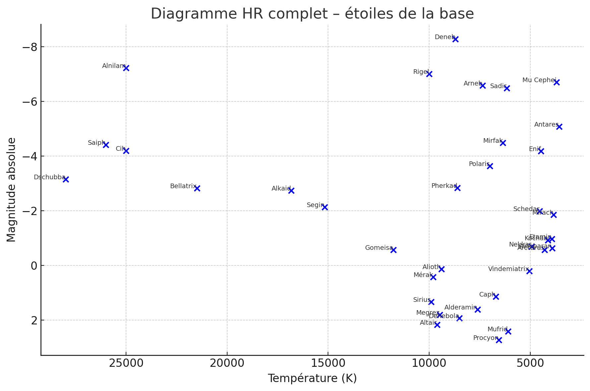

# 🌌 AstresDB – A Stellar Journey in SQL and Linux

**Author**: Jérôme ([@Jerome-X1](https://github.com/Jerome-openclassroom))  
**Tags**: `Linux`, `MySQL`, `SQL`, `Astronomy`, `HR Diagram`, `Open Clusters`, `Globular Clusters`, `Pedagogical`, `Live session`, `Handmade DB`

## 🧭 Project Overview

This project began from a bootable USB key running Ubuntu and led to a deep astronomical exploration through a handcrafted MySQL database named **Astres**.

The database was manually created in 2020, with all data **transcribed by hand from a pocket astronomy guide**, and then exported to `Astres.sql`. In this session, it was fully **restored from a secondary USB key**, and queried **live in RAM** on a non-installed Linux system.

## 🛠️ Technical Execution

- ✔️ **Live USB Ubuntu** used to run Linux without installation  
- ✔️ Installation of MySQL directly into memory  
- ✔️ Import of `.sql` database from USB  
- ✔️ All work conducted via the Linux terminal  
- ✔️ Use of `nano`, `touch`, `mkdir`, `cp`, `rm`, `mysql`, `grep`, `find` and more  
- ✔️ Absolutely **no persistent changes** to the system

## 🔭 Astronomy Data Included

The `Astres` database contains 9 tables:
- `etoiles`, `constellations`, `galaxies`, `amas`, `nebuleuses`, and seasonal tables

Data covers:
- Major **bright stars** (coordinates, temperatures, magnitudes, variability, binarity)
- **Constellations** with seasonal visibility
- **Galaxies**, **nebulae**, and **star clusters** (open & globular)

## 📈 Highlighted Analyses

### 🟡 1. **Hertzsprung–Russell Diagram**

- Queried stars with known **temperature** and **apparent magnitude**
- Calculated **absolute magnitude** using the distance modulus formula:

  ```
  M = m - 5 × (log10(d) - 1)
  ```

- Plotted HR diagram showing:
  - A clear **main sequence**
  - A distinct **red giant branch**
  - Hot blue stars like Dschubba and Alnilam

<p align="center">
  
</p>

    
> 💡 **Note:** For most stars in the dataset (within a few thousand light-years), the effect of interstellar reddening is negligible and was not included in the magnitude correction. This approximation holds for local HR diagram analysis but may require refinement for distant or obscured stars.

### 🟢 2. **Galactic Structure: Disk vs Halo**

- Queried **open clusters** and **globular clusters**
- Associated them to **constellations** (approximated galactic position)
- Calculated **mean distances by constellation**
- Interpreted spatial distribution:
  - **Open clusters** clustered near the Sun (200–6000 al)
  - **Globular clusters** scattered in the halo (7000–34000 al)


### 🔵 3. **AI-Guided Reasoning and Diagram Generation**

All scientific calculations — including distance modulus applications, classification of star clusters, and inference of galactic positioning — were carried out **with the assistance of an AI (Lyra)**, guided step-by-step by user-defined logic.

The user:
- Defined the structure of the **HR diagram** (temperature vs. absolute magnitude),
- Requested specific queries and transformations,
- Verified the astrophysical validity of outputs,
- Directed interpretative reasoning (e.g. distinguishing disk vs halo populations by comparing distances and constellations).

This dynamic approach showcases the **true pedagogical synergy between human reasoning and AI execution**, enabling real-time scientific insight from raw SQL data.


## 📁 File Structure

```
├── Astres.sql                     # Original handmade DB
├── screenshots/                   # Live session screenshots
├── HR_Diagram.png     	    # Full HR diagram (absolute magnitudes)
├── galaxy_structure_analysis.md   # Cluster stats and interpretations
└── README.md                      # This file
```

## 🧠 Educational Value

This project is a **live and interdisciplinary demonstration**:

| Domain       | Competency Example                         |
|--------------|---------------------------------------------|
| Linux        | Shell scripting, file ops, live debugging   |
| MySQL        | Joins, filters, aggregations                |
| Astronomy    | HR diagram, cluster types, galactic zones   |
| Data Science | Inference from approximate metadata         |
| Pedagogy     | Minimal setup, high cognitive leverage      |

Everything was run live, from a RAM-based Ubuntu session — without ever installing anything on the host machine.

## ✨ Sample Query (HR Prep)

```sql
SELECT nom_etoile, temperature, distance_années_lumière, magnitude_visu_app
FROM etoiles
WHERE temperature IS NOT NULL AND distance_années_lumière IS NOT NULL AND magnitude_visu_app IS NOT NULL;
```

## 🪐 Conclusion
🧭 Methodological Insight: AI-Assisted Scientific Exploration
This project demonstrates how artificial intelligence can assist not only in scientific calculation and visualization, but in building a structured, reasoned exploration path. From hypothesis to diagram, the AI responds to user-guided logic, while preserving human validation and interpretation at each step.

This dynamic reveals a new model of scientific collaboration, where creativity, structure, and rigor converge in a dialogue between human insight and computational support. The iterative interaction observed in this project—SQL queries, astrophysical reasoning, classification logic, and data interpretation—illustrates how AI extends cognitive reach rather than replacing it.

Such workflows anticipate the post-AGI research paradigm, where citizen scientists, researchers, and enthusiasts will co-navigate knowledge landscapes with intelligent systems, guided by curiosity, methodological clarity, and shared epistemic trust.

A blend of:
- Personal archive recovery,
- AI,
- Linux,
- SQL,
- and real-world stars and galactic interpretation.

**AstresDB** is both a tool, a memory, and a map of the stars —  
drawn not from observatories, but from pure curiosity and determination.
---

🔗 **Related historical project**:  
[Main GitHub profile](https://github.com/Jerome-openclassroom)  
- [Related project: VLTI Mirror Curvature Modeling (VBA, 2005)](https://github.com/Jerome-openclassroom/VLTI_Mirror_Curvature_Model_C_VBA_2005)  
- [Related project: Artisan Spectroscopy & Plasma Physics](https://github.com/Jerome-openclassroom/Artisan_Spectroscopy_Plasma_Physics)
- [Related project: Lyra SunTrack](https://github.com/Jerome-openclassroom/Lyra_SunTrack)  
 


